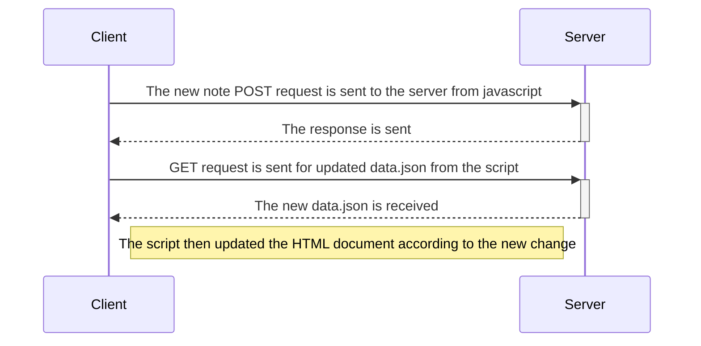

## This diagram describes the sequence flow of creating new note in the [SPA](https://studies.cs.helsinki.fi/exampleapp/spa)

```mermaid
sequenceDiagram
    participant Client
    participant Server

	Client->>+Server: The new note POST request is sent to the server from javascript
	Server-->>-Client: The response is sent

 
	Client->>+Server: GET request is sent for updated data.json from the script
	Server-->>-Client: The new data.json is received

	Note right of Client: The script then updated the HTML document according to the new change

```
