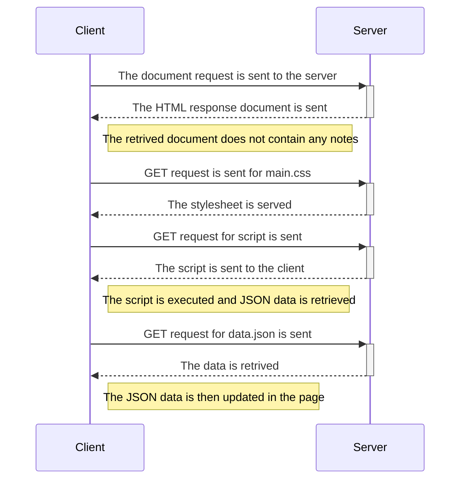

## This diagram describes the sequence flow of visiting the Notes [SPA](https://studies.cs.helsinki.fi/exampleapp/spa)

```mermaid
sequenceDiagram
    participant Client
    participant Server

	Client->>+Server: The document request is sent to the server
	Server-->>-Client: The HTML response document is sent
  Note right of Client: The retrived document does not contain any notes

	Client->>+Server: GET request is sent for main.css
	Server-->>-Client: The stylesheet is served

	Client->>+Server: GET request for script is sent
	Server-->>-Client: The script is sent to the client

	Note right of Client: The script is executed and JSON data is retrieved

	Client->>+Server: GET request for data.json is sent
	Server-->>-Client: The data is retrived
  Note right of Client: The JSON data is then updated in the page

```
